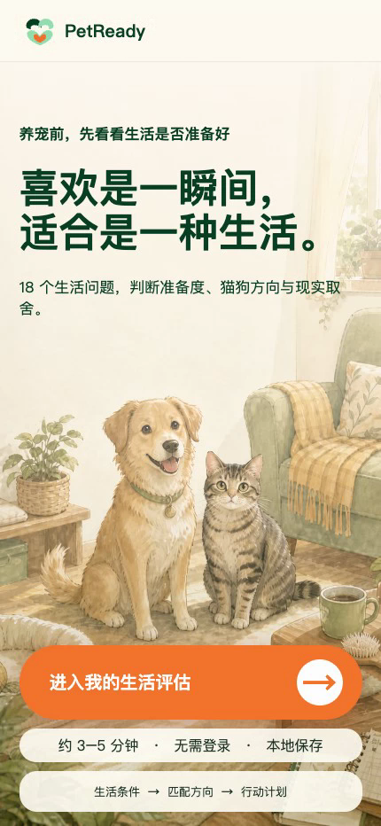

# PetReady

一款移动端优先的养宠决策工具：通过 18 个生活问题，评估养宠准备度、猫狗方向、品种匹配与现实取舍。后端负责题库、品种库和评估计算，不保存用户身份或答案；答题进度只保存在浏览器本机。

在线体验：<https://spbvdrl9ev15m2jced0kq.apigateway-cn-beijing.volceapi.com/>


## 功能演示

<p align="center">
  <a href="./docs/PetReady-H5-demo.webm">
    
  </a>
</p>

<p align="center"><a href="./docs/PetReady-H5-demo.webm">▶ 点击播放 1 分 05 秒 H5 功能演示</a></p>

## 启动

```bash
npm start
```

浏览器打开 <http://127.0.0.1:4173>。

## 验证

```bash
npm test
```

接口：`GET /api/questions`、`GET /api/breeds`、`POST /api/assess`。

## 开源许可

本项目采用 [MIT License](LICENSE)。
